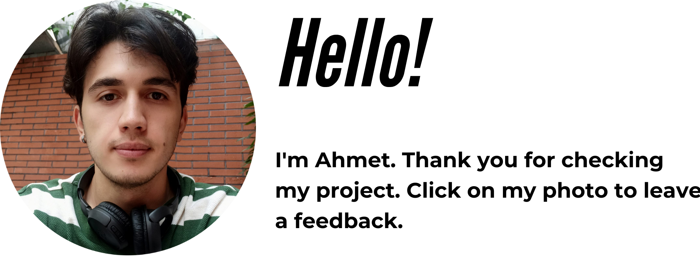

<p align="center">
<a href="https://www.linkedin.com/in/ahmet-ayd%C4%B1n-2583b1199/" target="_blank"></a>
</p>


# Project : Nature Responsive Website 


## Table of contents

  - [The challenge](#the-challenge)
  - [Screenshot](#screenshot)
  - [Project Skeleton](#project-skeleton)
  - [Links](#links)
  - [Built with](#built-with)
  - [Steps To Project](#steps-to-project)
  - [Useful resources](#useful-resources)
  - [How to Use the Project](#how-to-use-the-project)
- [Author](#author)

## The challenge
Project aims to create a nature website.

## Problem Statement

- Your company has recently started on a project that aims to create a nature website. So you and your colleagues have started to work on the project.

## Project Skeleton 

```
nature-website(folder)

|----README.md                   
|----index.html  
|----style.css   
```

## Screenshot

<a href="https://bavi-boop.github.io/nature-website/"></a>

## Links

<hr>
<b>Check The Live Website ➡️</b> <a href="https://bavi-boop.github.io/nature-website/">Live Website</a>
<hr>

### Built with

- Semantic HTML5 markup
- CSS custom properties
- Flexbox
- CSS Grid
- Mobile-first workflow

- [Styled Components](https://styled-components.com/) - For styles
	
- HTML Forms-Input Types 

- HTML Form Elements

- CSS Colors-Border Properties

- CSS Margins-Padding

- CSS Properties for Texts-Font Families-Links


-

## Notes

- You can use HTML,and CSS to complete this project.

### Useful resources

- [W3 Schoold](https://www.w3schools.com/) - This helped me for basics of website paradigm. I really liked this pattern and will use it going forward.
- [MDN](https://developer.mozilla.org/en-US/) - This is an amazing document which helped me finally understand deep sides of web development. I'd recommend it to anyone still learning these concepts.
- [Tutorial](https://www.youtube.com/watch?v=JYWitDwHhxE) - This Project is completed thanks to Coding snow.

### How to Use the Project
<span>First download a code editor </span>
<br><span>Second open the files : </span><a href='https://github.com/BAVI-BOOP/tea-cozy-website'>My Docs</a>
<br><span>You can use this tutorial : </span><a href='https://www.youtube.com/watch?v=fJEbVCrEMSE'>VS Code tutorial</a>


## Author

- Author - [Ahmet]

<center> &#8987; Happy Coding  &#9997; </center>
